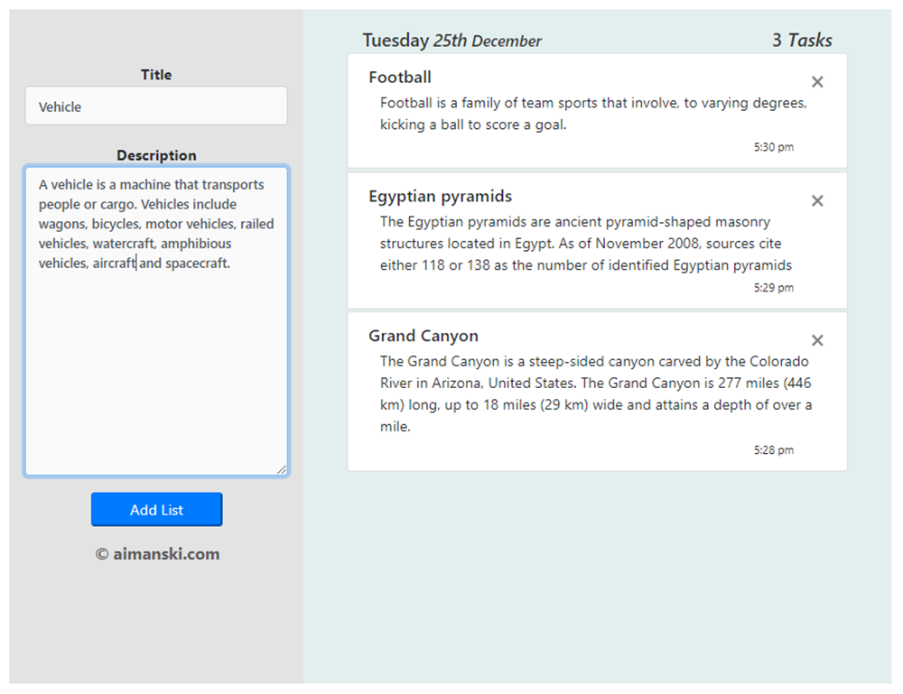

### `TodoList App with Title and Description`
This is a React Project I created for anybody to use.  

The project basically looks like this. 

This application helps you create some tasks and will be saved 
to a database in the Google Firebase. 

This project was bootstrapped with [Create React App](https://github.com/facebook/create-react-app).

### `npm start`

Runs the app in the development mode. 
Open [http://localhost:3000](http://localhost:3000) to view it in the browser.

